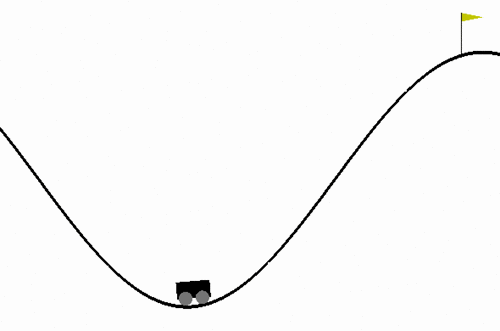
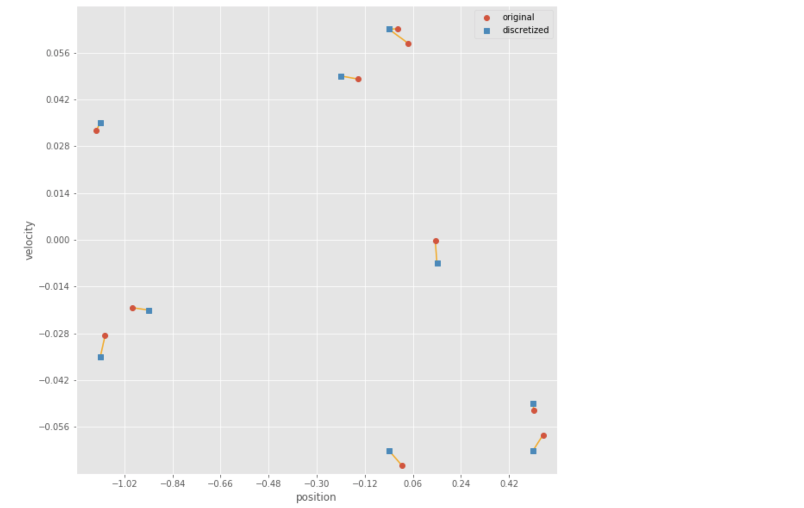
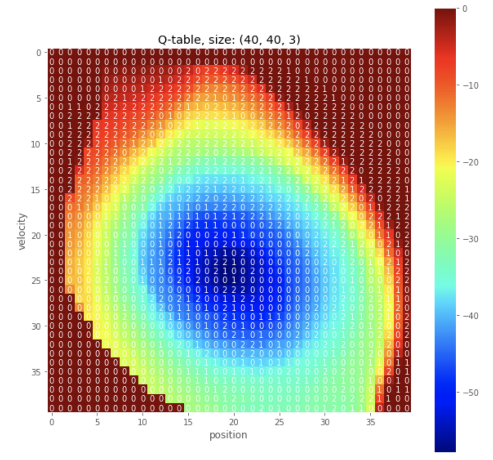

# Discretization



The reinforcement learning environments where the number of states and actions is limited i.e. with small, finite **Markov Decision Processes (MDPs)**, it is possible to represent the action-value function with a table, dictionary, or other finite structure.

For instance, consider the very small gridworld which has four possible states, and the agent has four possible actions at its disposal (up, down, left, right). We can represent the estimated optimal action-value function in a table, with a row for each state and a column for each action. We refer to this table as a **Q-table**.

But what about MDPs with much larger spaces? Consider that the Q-table must have a **row for each state**. So, for instance, if there are 10 million possible states, the Q-table must have 10 million rows. Furthermore, if the state space is the set of continuous [real-valued numbers](https://en.wikipedia.org/wiki/Real_number) (an **infinite** set!), it becomes impossible to represent the action values in a **finite** structure! 

One of the possible soultion is **discretization**, which divides the continious space in discrete space; thus enable us to use tradition reinforcement learning algorithms for complex MDPs.



Function to create uniformly-spaced grid that can be used to discretize a space.

```python
def create_uniform_grid(low, high, bins=(10, 10)):
    """Define a uniformly-spaced grid that can be used to discretize a space.
    
    Parameters
    ----------
    low : array_like
        Lower bounds for each dimension of the continuous space.
    high : array_like
        Upper bounds for each dimension of the continuous space.
    bins : tuple
        Number of bins along each corresponding dimension.
    
    Returns
    -------
    grid : list of array_like
        A list of arrays containing split points for each dimension.
    """
    return [np.linspace(low[dim], high[dim], bins[dim] + 1)[1:-1] for dim in range(len(bins))]
```

Function to discretize a sample as per given grid.

```python
def discretize(sample, grid):
    """Discretize a sample as per given grid.
    
    Parameters
    ----------
    sample : array_like
        A single sample from the (original) continuous space.
    grid : list of array_like
        A list of arrays containing split points for each dimension.
    
    Returns
    -------
    discretized_sample : array_like
        A sequence of integers with the same number of dimensions as sample.
    """
    return list(int(np.digitize(s, g)) for s, g in zip(sample, grid))  # apply along each dimension
```



### Resources

To learn about more advanced discretization approaches, refer to the following:

- Uther, W., and Veloso, M., 1998. [Tree Based Discretization for Continuous State Space Reinforcement Learning](http://www.cs.cmu.edu/~mmv/papers/will-aaai98.pdf). In _Proceedings of AAAI, 1998_, pp. 769-774.
- Munos, R. and Moore, A., 2002. [Variable Resolution Discretization in Optimal Control](https://link.springer.com/content/pdf/10.1023%2FA%3A1017992615625.pdf). In _Machine Learning_, 49(2), pp. 291-323.

### Instructions

This project is a part of [Udacity Deep Reinforcement Learning Nanodegree](https://www.udacity.com/course/deep-reinforcement-learning-nanodegree--nd893). Follow the instructions in `Discretization.ipynb` to learn how to discretize continuous state spaces, to use tabular solution methods to solve complex tasks.